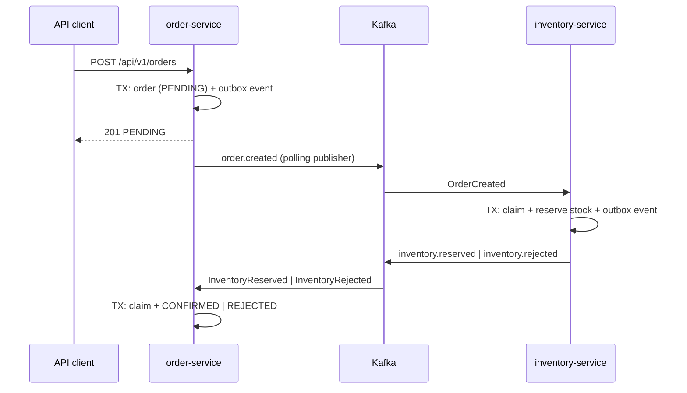

# Resilient Order Pipeline

[](https://github.com/<tu-usuario>/resilient-order-pipeline/actions/workflows/ci.yml)

A reference backend for reliable, event-driven order processing: eventual consistency and fault tolerance across two services, built on Kafka and PostgreSQL.

## Status

**Under development. `v0.1.0` has not been released.**

Everything described below is a design goal, not finished functionality. This README will be updated as each part is built and verified, and a quick start will be added once the setup has been tested from a clean clone.

## The problem

Creating an order is a synchronous operation, but what comes after it (reserving stock, confirming or rejecting the order) happens asynchronously in another service. These steps cannot be wrapped in a single ACID transaction. The naive approach of "save to the database, then publish to Kafka" is a dual write: if the process crashes between the two steps, the order exists but the event is lost, and the order stays in `PENDING` forever.

This project explores how to keep the business flow coherent despite that gap, without distributed transactions.

## What this project is designed to demonstrate

- **Transactional Outbox** in both services: state changes and outgoing events are persisted in the same local transaction and published afterwards by a polling publisher.
- **Idempotent consumers**: duplicate deliveries (inherent to at-least-once messaging) produce the business effect only once.
- **Retries and Dead Letter Topics**: transient failures are retried with a short backoff (which briefly blocks the partition, a deliberate trade-off); messages that exhaust their retries go to a DLT so they never block subsequent messages indefinitely. Non-recoverable errors (such as an invalid payload) skip the retries and go straight to the DLT.
- **Stock reservation without overselling** under concurrent requests, delegating atomicity to the database.
- **Recovery from Kafka outages**: an order that was already persisted is never lost if the broker is down, and its event is published automatically once Kafka returns.
- **Lightweight hexagonal architecture**: the domain layer has no dependency on Kafka, JPA or Spring, to be enforced by an automated architecture test.
- **Testing against real infrastructure** (PostgreSQL and Kafka via Testcontainers) instead of mocks, including failure scenarios.

## Scope

A single release, `v0.1.0`, with no planned follow-up phases.

**This is not an e-commerce application.** The business domain is deliberately minimal; it exists only to give the event-driven patterns something real to operate on.

Out of scope: UI, payments, user management, OAuth2 or external identity providers, Kubernetes or cloud deployment, Saga frameworks, and end-to-end exactly-once delivery.

## Architecture at a glance

Two independent Spring Boot services, `order-service` and `inventory-service`, share a single PostgreSQL instance but each owns its own schema and database role, so neither can query the other's tables. They communicate exclusively through Kafka (KRaft mode, no ZooKeeper). Each service has its own outbox. Delivery is at-least-once, and correctness comes from consumer idempotency rather than from broker guarantees. PostgreSQL is the source of truth for all business state; Kafka is transport only.

The environment is designed to run as four containers (`order-service`, `inventory-service`, `postgres`, `kafka`) with a single `docker compose up --build`.

### Target flow



An order starts as `PENDING` and ends as `CONFIRMED` or `REJECTED`, both terminal.

## Key design decisions

Full records, including alternatives and consequences, live in [`docs/adr`](docs/adr/README.md).

| Decision | ADR |
|---|---|
| Outbox published by an embedded polling publisher | [0001](docs/adr/0001-transactional-outbox-polling-publisher.md) |
| One schema and one role per service in a single PostgreSQL instance | [0002](docs/adr/0002-schema-and-role-per-service.md) |
| Message key = aggregate ID, for per-order ordering | [0003](docs/adr/0003-partition-key-aggregate-id.md) |
| Retries with exponential backoff and dead-letter topics | [0004](docs/adr/0004-consumer-retry-and-dead-letter-topics.md) |
| Self-issued JWT validated by a Resource Server | [0005](docs/adr/0005-self-issued-jwt-with-resource-server.md) |
| Lightweight hexagonal architecture | [0006](docs/adr/0006-lightweight-hexagonal-architecture.md) |
| Stock reservation with a conditional `UPDATE` and savepoint | [0010](docs/adr/0010-atomic-conditional-update-for-stock-reservation.md) |
| Idempotent consumers in one local transaction | [0011](docs/adr/0011-idempotent-consumer-single-local-transaction.md) |
| Outbox in both services | [0013](docs/adr/0013-outbox-in-inventory-service.md) |
| Independent services, no shared module | [0016](docs/adr/0016-independent-services-no-shared-module.md) |

## Planned evidence

The core claims of this project are meant to be proven by tests, not asserted. This table will be completed with links and results as each test is implemented.

| Claim | Test | Status |
|---|---|---|
| Kafka down does not lose a persisted order | Kafka outage: orders return `201`, events publish after recovery | Planned |
| A duplicate event produces its effect once | Same `eventId` delivered twice, one stock decrement | Planned |
| A poison message ends in the DLT without blocking | 3 retries with backoff, then DLT; next messages processed | Planned |
| No overselling under concurrency | N concurrent reservations, stock for one, exactly one succeeds | Planned |

## Known limitations (by design)

- An order whose event reaches the DLT stays `PENDING`; there is no compensation or DLT replay.
- Reserved stock is never released (no cancellation or expiry).
- Publication latency is up to the polling interval (5 s by default), and the outbox is not purged.
- One instance per service; no horizontal scaling.
- `POST /auth/token` is a custom credential exchange, **not OAuth2**. HTTP only, no rate limiting.
- Single-node Kafka (replication factor 1) and a single shared PostgreSQL instance.

## Tech stack

- **Language:** Java 21
- **Framework:** Spring Boot 4.1.1 (Spring Framework 7)
- **Build:** Maven (multi-module) with Maven Wrapper
- **Database:** PostgreSQL 16, with Flyway migrations
- **Persistence:** JPA for the `Order` aggregate, `JdbcClient` for outbox, stock and technical tables
- **Messaging:** Apache Kafka 4.2.2 (KRaft) with Spring Kafka
- **Security:** Spring Security 7 Resource Server with self-issued JWT (HS256)
- **Logging:** Spring Boot structured logging (Logstash JSON format) with MDC
- **Testing:** JUnit Jupiter, AssertJ, Awaitility, ArchUnit and Testcontainers 2
- **Code style:** Spotless (google-java-format)
- **Environment:** Docker Compose
- **CI:** GitHub Actions and Dependabot

## Documentation

- [`docs/adr`](docs/adr/README.md): architecture decision records (ADR-0001 to ADR-0018)
- `docs/srs.md`: requirements specification *(planned)*
- `docs/sdd.md`: design description *(planned)*
- `docs/events.md`: event contracts *(planned)*

## Building from source

Requires JDK 21 and a running Docker engine (integration tests use Testcontainers).

```powershell
.\mvnw.cmd clean verify      # Windows (PowerShell)
```

```bash
./mvnw clean verify          # Linux / macOS
```

A full quick start with Docker Compose will be added once it has been verified from a clean clone.

## License

Licensed under the Apache License 2.0. See [LICENSE](LICENSE).
