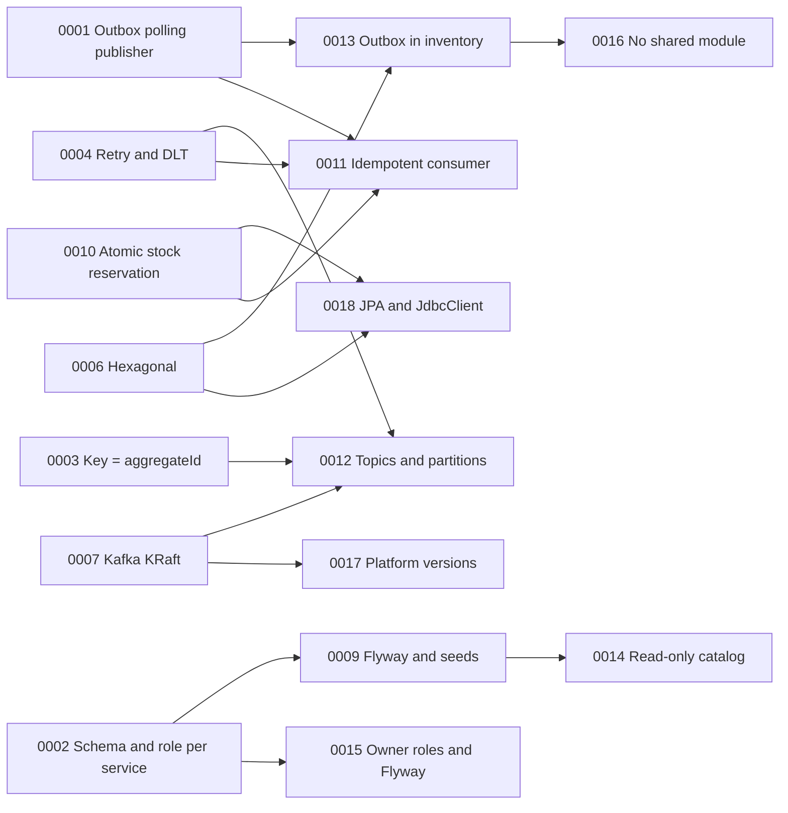

# Architecture Decision Records

Architecture decisions for **Resilient Order Pipeline**, a reference backend that demonstrates the transactional outbox, idempotent consumers, retries with dead-letter topics, oversell-free concurrency and tolerance to Kafka outages.

All records follow a reduced [MADR](https://adr.github.io/madr/) format. Each one contains:

1. **Context and Problem Statement**: the forces and requirements behind the decision.
2. **Decision Drivers** and **Considered Options**.
3. **Decision Outcome**, including **Consequences** (good and bad, stated honestly).
4. **Confirmation**: the test or check that demonstrates the decision. Test numbers refer to the evidence tests listed in the main README; links are added in the pull request of the phase that implements each test.
5. **Pros and Cons of the Options** and **More Information** (related ADRs and requirement IDs).

All ADRs are `accepted` as of 2026-10-05.

## Index

### Messaging and reliability

| ADR | Decision | Key requirements |
|---|---|---|
| [0001](0001-transactional-outbox-polling-publisher.md) | Embedded polling publisher for the transactional outbox | BR-008, REQ-FUNC-004 / 010 / 011 |
| [0003](0003-partition-key-aggregate-id.md) | Kafka message key = `aggregateId` | REQ-OBS-001 |
| [0004](0004-consumer-retry-and-dead-letter-topics.md) | `DefaultErrorHandler`, 1/2/4 s backoff and DLT | REQ-REL-001 |
| [0011](0011-idempotent-consumer-single-local-transaction.md) | Idempotent consumer in one local transaction | BR-007, REQ-FUNC-016 / 019 |
| [0012](0012-declarative-topics-three-partitions.md) | Declarative topics, 3 partitions, RF 1 | REQ-FUNC-018 |
| [0013](0013-outbox-in-inventory-service.md) | Outbox also in `inventory-service` | BR-008, REQ-FUNC-020 |

### Data and persistence

| ADR | Decision | Key requirements |
|---|---|---|
| [0002](0002-schema-and-role-per-service.md) | One schema and one role per service | BR-009, BR-010 |
| [0009](0009-flyway-migrations-and-seed-data.md) | Flyway with one migration path per service and seeds | REQ-FUNC-017, REQ-INST-001 |
| [0010](0010-atomic-conditional-update-for-stock-reservation.md) | Conditional `UPDATE` with savepoint for stock reservation | BR-015, REQ-FUNC-012 / 013 |
| [0014](0014-read-only-product-catalog.md) | Read-only product catalog; clients never send prices | REQ-FUNC-003, BR-018 |
| [0015](0015-schema-owner-roles-and-flyway.md) | Schema-owner roles; Flyway runs with the service role | REQ-INST-001 |
| [0018](0018-jpa-for-order-aggregate-jdbcclient-elsewhere.md) | JPA for `Order` only, `JdbcClient` elsewhere | REQ-FUNC-003 / 004 / 012 |

### Architecture and security

| ADR | Decision | Key requirements |
|---|---|---|
| [0005](0005-self-issued-jwt-with-resource-server.md) | Self-issued JWT (Nimbus) validated by Resource Server | REQ-FUNC-007 / 008 / 009, REQ-SEC-001 / 002 |
| [0006](0006-lightweight-hexagonal-architecture.md) | Lightweight hexagonal architecture | REQ-MAINT-001, BR-014 |
| [0016](0016-independent-services-no-shared-module.md) | Independent services, no shared code module | REQ-MAINT-002 |

### Platform and tooling

| ADR | Decision | Key requirements |
|---|---|---|
| [0007](0007-kafka-kraft-single-node.md) | Kafka 4.x in KRaft mode, single node | REQ-INST-001, REQ-COST-001 |
| [0008](0008-native-structured-logging-with-mdc.md) | Native structured logging with MDC | REQ-OBS-001, REQ-SEC-002 |
| [0017](0017-java-21-spring-boot-4-kafka-4.md) | Java 21, Spring Boot 4.1.x, Kafka 4.x | REQ-COMP-001, REQ-BUILD-001 |

## How the decisions relate

## Reading order

* **The core reliability story:** 0001 → 0011 → 0004 → 0010 → 0013.
* **Data boundaries:** 0002 → 0015 → 0009 → 0014 → 0018.
* **Code structure:** 0006 → 0016.

## Requirement traceability

| Requirement | ADRs |
|---|---|
| BR-007, REQ-FUNC-016 | 0011 |
| BR-008, REQ-FUNC-004, REQ-FUNC-020 | 0001, 0013 |
| BR-009, BR-010 | 0002 |
| BR-014, REQ-FUNC-019 | 0004, 0006, 0011 |
| BR-015, REQ-FUNC-012, REQ-FUNC-013 | 0010 |
| BR-018, REQ-FUNC-003 | 0014, 0018 |
| REQ-FUNC-007 / 008 / 009 | 0005 |
| REQ-FUNC-010, REQ-FUNC-011 | 0001 |
| REQ-FUNC-017 | 0009 |
| REQ-FUNC-018 | 0012 |
| REQ-REL-001 | 0004 |
| REQ-OBS-001, REQ-SEC-002 | 0008 |
| REQ-SEC-001 | 0005 |
| REQ-MAINT-001 | 0006 |
| REQ-MAINT-002 | 0016 |
| REQ-INST-001 | 0007, 0009, 0015 |
| REQ-COST-001 | 0001, 0007 |
| REQ-COMP-001, REQ-BUILD-001 | 0017 |

## Changing a decision

* Changing a decision means updating the affected ADR, together with every document it touches, in the **same pull request**.
* A reversed decision is not erased: its status becomes `superseded by ADR-XXXX` and the new ADR explains why.
* Identifiers (`ADR-*`, `BR-*`, `REQ-*`) are stable and are cited in tests, commit messages and documentation.
