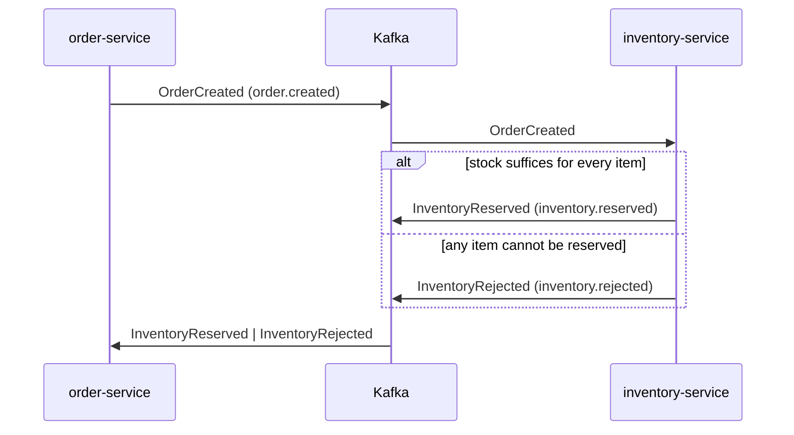

# Event Contracts

This document is the contract for every message exchanged through Kafka between `order-service` and `inventory-service`. There is no Schema Registry and the services share no code module ([ADR-0016](adr/0016-independent-services-no-shared-module.md)), so this file is the only reference both sides are checked against. Each service implements its own `EventEnvelopeMapper` from it.

## Overview

| Event | Topic | Producer | Consumer (group) | Message key |
|---|---|---|---|---|
| `OrderCreated` | `order.created` | `order-service` | `inventory-service` | `aggregateId` |
| `InventoryReserved` | `inventory.reserved` | `inventory-service` | `order-service` | `aggregateId` |
| `InventoryRejected` | `inventory.rejected` | `inventory-service` | `order-service` | `aggregateId` |

Each topic has a dead-letter topic (`order.created.DLT`, `inventory.reserved.DLT`, `inventory.rejected.DLT`) that receives records the consumer could not process. See [Failure handling](#failure-handling).



## Envelope

Every event, regardless of type, uses the same envelope. The Kafka record value is this JSON document serialized as a `String` (`StringSerializer` / `StringDeserializer`).

```json
{
  "eventId": "uuid",
  "eventType": "OrderCreated | InventoryReserved | InventoryRejected",
  "occurredAt": "ISO-8601 UTC",
  "aggregateId": "orderId",
  "payload": {}
}
```

| Field | Type | Required | Description |
|---|---|---|---|
| `eventId` | string (UUID) | yes | Unique identifier of the event. Consumers deduplicate on it (see [Delivery semantics](#delivery-semantics)). |
| `eventType` | string | yes | One of `OrderCreated`, `InventoryReserved`, `InventoryRejected`. It also determines the topic. |
| `occurredAt` | string (ISO-8601, UTC) | yes | Moment the event was created, set by the producer when it writes the event. |
| `aggregateId` | string (max 64) | yes | Identifier of the aggregate the event belongs to. In this system it is always the `orderId`. |
| `payload` | object | yes | Event-specific body, defined per event below. |

The `eventType` to topic mapping is resolved by the producer when it writes the event to its outbox (`outbox_events.topic`):

| `eventType` | Topic |
|---|---|
| `OrderCreated` | `order.created` |
| `InventoryReserved` | `inventory.reserved` |
| `InventoryRejected` | `inventory.rejected` |

## Events

### OrderCreated

Emitted by `order-service` in the same transaction that persists a new order in status `PENDING`. It carries only what `inventory-service` needs to reserve stock. Prices and totals are intentionally not part of the event.

| Payload field | Type | Required | Description |
|---|---|---|---|
| `orderId` | string (UUID) | yes | Identifier of the order. Equal to the envelope's `aggregateId`. |
| `items` | array | yes | Items to reserve. Never empty. |
| `items[].productId` | string (max 64) | yes | Product identifier. |
| `items[].quantity` | integer | yes | Units requested. Always greater than 0. |

```json
{
  "eventId": "3f6c1a52-8d0b-4c1e-9a77-2b5e4d9f01aa",
  "eventType": "OrderCreated",
  "occurredAt": "2026-10-05T14:30:12.345Z",
  "aggregateId": "b2a8c7e0-5f1d-4e63-8a39-7c0d1e2f3a4b",
  "payload": {
    "orderId": "b2a8c7e0-5f1d-4e63-8a39-7c0d1e2f3a4b",
    "items": [
      { "productId": "SKU-001", "quantity": 2 },
      { "productId": "SKU-003", "quantity": 1 }
    ]
  }
}
```

**Consumer behavior (`inventory-service`).** It reserves stock for **all** items or for none. If every item can be reserved, it decrements the stock and emits `InventoryReserved`. If any item cannot be reserved, no decrement is persisted and it emits `InventoryRejected`. A rejection is a business result, not an error.

### InventoryReserved

Emitted by `inventory-service` when stock was reserved for every item of the order, in the same transaction that decrements the stock.

| Payload field | Type | Required | Description |
|---|---|---|---|
| `orderId` | string (UUID) | yes | Identifier of the reserved order. Equal to the envelope's `aggregateId`. |

```json
{
  "eventId": "9d41e7b3-2c6a-47f0-b1d5-0a8e6c3f7b12",
  "eventType": "InventoryReserved",
  "occurredAt": "2026-10-05T14:30:12.902Z",
  "aggregateId": "b2a8c7e0-5f1d-4e63-8a39-7c0d1e2f3a4b",
  "payload": {
    "orderId": "b2a8c7e0-5f1d-4e63-8a39-7c0d1e2f3a4b"
  }
}
```

**Consumer behavior (`order-service`).** It moves the order from `PENDING` to `CONFIRMED`. `CONFIRMED` is terminal.

### InventoryRejected

Emitted by `inventory-service` when the order could not be reserved. Any partial decrements are undone, and the event is committed in the same transaction as the idempotency claim.

| Payload field | Type | Required | Description |
|---|---|---|---|
| `orderId` | string (UUID) | yes | Identifier of the rejected order. Equal to the envelope's `aggregateId`. |
| `reason` | string (enum) | yes | Why the order was rejected: `INSUFFICIENT_STOCK` or `UNKNOWN_PRODUCT`. |

| `reason` | Meaning |
|---|---|
| `INSUFFICIENT_STOCK` | The product has a stock row, but the available quantity is lower than requested. |
| `UNKNOWN_PRODUCT` | The product has no stock row. |

```json
{
  "eventId": "c7e5a0f4-61b9-4d28-8e3c-5f2a9b1d6e07",
  "eventType": "InventoryRejected",
  "occurredAt": "2026-10-05T14:31:40.118Z",
  "aggregateId": "e41d92a6-0b7c-4f85-a1d3-6c8e2b5f9a30",
  "payload": {
    "orderId": "e41d92a6-0b7c-4f85-a1d3-6c8e2b5f9a30",
    "reason": "INSUFFICIENT_STOCK"
  }
}
```

**Consumer behavior (`order-service`).** It moves the order from `PENDING` to `REJECTED`. `REJECTED` is terminal.

## Delivery semantics

- **At-least-once.** An event can be delivered more than once: the outbox publisher may republish, and a consumer may crash between its database commit and its offset commit. Exactly-once delivery is out of scope.
- **Idempotent consumers.** A consumer applies the effect of an event only once per `(eventId, consumer)`. Duplicates are logged and ignored ([ADR-0011](adr/0011-idempotent-consumer-single-local-transaction.md)). The `consumer` value is the consumer group name.
- **Ordering per order.** The message key is the `aggregateId`, so all events of one order go to the same partition and are consumed in publication order ([ADR-0003](adr/0003-partition-key-aggregate-id.md)). There is no ordering guarantee across different orders.
- **Atomic publication.** A producer writes the event to its outbox in the same local transaction as the state change it describes, and a polling publisher sends it to Kafka afterwards ([ADR-0001](adr/0001-transactional-outbox-polling-publisher.md), [ADR-0013](adr/0013-outbox-in-inventory-service.md)).
- **Invalid transitions are no-ops.** An event that does not apply to the current state of the order (for example `InventoryReserved` on a `REJECTED` order), or that refers to an unknown aggregate, is recorded as processed and logged, without exception, retry or dead-letter entry.

## Topics and client configuration

All six topics (three event topics and their `.DLT`) have **3 partitions and replication factor 1**, are declared by the services at startup and are never auto-created ([ADR-0012](adr/0012-declarative-topics-three-partitions.md)).

| Side | Setting |
|---|---|
| Producer | `acks=all`, client idempotence enabled, `max.block.ms=5000`, `request.timeout.ms=5000`, `delivery.timeout.ms=10000`. The publisher waits for the acknowledgement for up to 15 s. |
| Consumer | `auto.offset.reset=earliest`, auto-commit disabled, `AckMode.RECORD`. |

## Failure handling

Failures while consuming follow [ADR-0004](adr/0004-consumer-retry-and-dead-letter-topics.md):

| Situation | Behavior |
|---|---|
| Transient failure | One delivery plus 3 retries with backoff of 1 s, 2 s and 4 s. If it still fails, the record is published to `<topic>.DLT` and the consumer continues. |
| Invalid JSON, payload outside this contract, or unknown `eventType` | `InvalidEventException`, not retryable. The record goes straight to `<topic>.DLT`. |
| Record in the DLT | Published to the same partition and with the same key as the original record. It is kept for manual inspection; there is no automatic replay. |

An order whose event ends up in a DLT stays in `PENDING`; there is no compensation in this version.

## Compatibility rules

The contract is kept backward compatible, since producer and consumer are deployed independently and there is no Schema Registry.

- Existing fields keep their name, type and meaning.
- New fields may be added only as optional, and consumers ignore fields they do not know.
- A change that breaks any of the above requires a new `eventType`, not a modification of an existing one.
- Any change to this contract is made in the same pull request as the code in **both** services and the affected tests.

## Related documents

- [ADR-0001](adr/0001-transactional-outbox-polling-publisher.md) Transactional outbox
- [ADR-0003](adr/0003-partition-key-aggregate-id.md) Message key
- [ADR-0004](adr/0004-consumer-retry-and-dead-letter-topics.md) Retries and dead-letter topics
- [ADR-0011](adr/0011-idempotent-consumer-single-local-transaction.md) Idempotent consumers
- [ADR-0012](adr/0012-declarative-topics-three-partitions.md) Topics and partitions
- [ADR-0016](adr/0016-independent-services-no-shared-module.md) No shared module
