# Software Design Description
## For Event-Driven Order Platform

Version 1
Prepared by KM
September 10, 2026

## Table of Contents
<!-- TOC -->
* [1. Introduction](#1-introduction)
  * [1.1 Document Purpose](#11-document-purpose)
  * [1.2 Subject Scope](#12-subject-scope)
  * [1.3 Definitions, Acronyms, and Abbreviations](#13-definitions-acronyms-and-abbreviations)
  * [1.4 References](#14-references)
  * [1.5 Document Overview](#15-document-overview)
* [2. Design Overview](#2-design-overview)
  * [2.1 Stakeholder Concerns](#21-stakeholder-concerns)
  * [2.2 Selected Viewpoints](#22-selected-viewpoints)
* [3. Design Views](#3-design-views)
* [4. Decisions](#4-decisions)
* [5. Appendixes](#5-appendixes)
<!-- TOC -->

## Revision History

| Name | Date | Reason For Changes | Version |
|------|------|--------------------|---------|
| Kaulin Mindiola | 2026-09-10 | Initial baseline, derived from SRS v1 and the 10 accepted decisions | 0.1 |
| Kaulin Mindiola | 2026-10-04 | final version | 1 |

## 1. Introduction

### 1.1 Document Purpose

This SDD describes **how** the Event-Driven Order Platform v1 is designed to satisfy the requirements specified in `docs/srs.md`, translating the architectural decisions recorded individually in the `docs/adr/` directory (ADR-0001 through ADR-0018, all accepted) into a concrete structure of components, interfaces, data, and behavior. Its primary audience is the author — acting as implementer — and any technical portfolio reviewer evaluating the rigor of the design. The document contains enough detail to begin implementation without descending to the level of source code.

### 1.2 Subject Scope

**Event-Driven Order Platform**, version v1, single release. The design fully covers the system defined in the SRS: two proprietary services (`order-service`, `inventory-service`) that collaborate asynchronously via Apache Kafka, with PostgreSQL as the shared source of truth (separate schemas per domain, ADR-0002), the Transactional Outbox pattern (ADR-0001), and idempotent consumers. It includes the design of: REST and event contracts, data model, JWT authentication, failure handling (Kafka down, retries, DLT), and deployment topology via Docker Compose. It explicitly excludes everything marked as Out-of-Scope in the SRS (UI, user management, external IdP, Kubernetes, CQRS/Event Sourcing, `notification-service`).

### 1.3 Definitions, Acronyms, and Abbreviations

| Term | Definition |
|------|------------|
| Adapter | An infrastructure component that implements a domain Port (e.g., a JPA repository implementing `OrderRepository`). |
| Aggregate | See SRS 1.3. |
| Bounded Context | An explicit boundary within which a domain model (entities, rules) is valid and consistent; in this system, `order-service` and `inventory-service` are separate bounded contexts. |
| Consumer Group | A logical grouping of instances of a Kafka consumer that share the partitions of a topic. |
| DLT | See SRS 1.3 (Dead Letter Topic). |
| Idempotent Consumer | See SRS 1.3. |
| JWT | See SRS 1.3. |
| KRaft | An operating mode of Apache Kafka that eliminates the Zookeeper dependency, using Kafka's own consensus protocol for metadata (see ADR-0007). |
| MDC | Mapped Diagnostic Context — an SLF4J/Logback mechanism for propagating structured fields (e.g., `orderId`, `eventId`) across the logs of a single thread of execution. |
| Outbox Pattern | See SRS 1.3. |
| Partition Key | The value used by the Kafka producer to determine the destination partition of a message; in this system it is always `aggregateId` (ADR-0003). |
| Port | An interface defined by the domain that abstracts an external dependency (persistence, messaging), implemented by an Adapter (see ADR-0006). |

### 1.4 References

| Title | Owner | Version | Location | Type |
|---|---|---|---|---|
| SRS — Event-Driven Order Platform | Kaulin Mindiola | 1 | `docs/srs.md` | Normative |
| ADR — Event-Driven Order Platform | Kaulin Mindiola | ADR-0001..018 | `docs/adr/` | Normative (decisions implemented by this design) |
| RFC 7807 — Problem Details for HTTP APIs | IETF | RFC 7807 | https://www.rfc-editor.org/rfc/rfc7807 | Normative (error format) |

### 1.5 Document Overview

Section 2 (Design Overview) identifies stakeholder concerns and selects, with justification, the viewpoints from the `sdd-template.md` catalog that actually add value to this system. Section 3 (Design Views) contains the concrete views — diagrams and descriptions — organized by viewpoint, each referencing the SRS REQ-* requirements it implements. Section 4 (Decisions) summarizes the 10 accepted decisions, deferring to `MADR.md` as the detailed source without duplicating its content. Section 5 (Appendixes) contains non-normative supporting material: an environment variable reference and a traceability matrix.

## 2. Design Overview

This system is an event-driven reference backend, with two services collaborating asynchronously under eventual consistency. The design approach prioritizes: (a) demonstrating the patterns required by the SRS (Outbox, Idempotent Consumer) in a verifiable way; (b) keeping the domain isolated from messaging technology (ADR-0006); and (c) avoiding complexity not justified by the portfolio scope (no CQRS, no Event Sourcing, no external observability infrastructure).

### 2.1 Stakeholder Concerns

| Stakeholder | Concern | Addressed by (viewpoint) |
|---|---|---|
| Developer/Implementer (the author) | Understand the structure well enough to implement it directly | Composition, Logical, Dependency, Interaction |
| Technical portfolio reviewer | Evaluate engineering rigor and the coherence between decisions and design | Patterns, Section 4 (Decisions), ADR references |
| API Client | Have stable input/output contracts | Interface |
| Operator (the author, in local mode) | Be able to start and observe the system without friction | Deployment |
| All of the above | Trust that eventual consistency and fault tolerance work as documented | Information, State Dynamics, Concurrency, Algorithm |

### 2.2 Selected Viewpoints

The 15 viewpoints in the `sdd-template.md` catalog were evaluated. Twelve were selected because they address a real, verifiable concern in this system; the remaining 3 are marked `N/A` with their justification, to avoid producing views with no added value.

#### 2.2.1 Context

**Selected.** The system has a single external actor (API Client) and no third-party systems — it is worth fixing that boundary explicitly. See DV-001.

#### 2.2.2 Composition

**Selected.** There are 4 physical deployable pieces (order-service, inventory-service, PostgreSQL, Kafka) whose relationship is not trivial to infer from the SRS alone. See DV-002.

#### 2.2.3 Logical

**Selected.** ADR-0006 requires an explicit domain/infrastructure separation via ports; this view makes those ports tangible. See DV-003, DV-004.

#### 2.2.4 Physical

**N/A.** There is no complex hardware or network topology — everything runs in local Docker containers on a single machine; cloud infrastructure is explicitly out of scope (SRS, Out-of-Scope).

#### 2.2.5 Structure

**N/A.** No entity in this system has an internal composition (fine-grained ports/connectors) that is not already covered by Composition and Logical.

#### 2.2.6 Dependency

**Selected.** REQ-MAINT-001 is literally a dependency-direction requirement (the domain must not import Kafka); this view makes it explicit and verifiable. See DV-005.

#### 2.2.7 Information

**Selected.** The data model (orders, order_items, outbox_events, processed_events, stock) is central to BR-009/BR-010. See DV-006.

#### 2.2.8 Interface

**Selected.** REQ-MAINT-002 requires documented event contracts; in addition, the REST contracts must be fully specified for the API Client. See DV-007, DV-008.

#### 2.2.9 Interaction

**Selected.** It is the heart of an event-driven system: both the happy path and the failure paths (Kafka down, duplicates, DLT) must be shown. See DV-009 through DV-012.

#### 2.2.10 Algorithm

**Selected.** Two algorithms are critical to the correctness of the system and non-trivial: idempotent deduplication and atomic stock reservation. See DV-013, DV-014.

#### 2.2.11 State Dynamics

**Selected.** The order lifecycle (PENDING/CONFIRMED/REJECTED) is an explicit business requirement (BR-003 through BR-005, BR-011). See DV-015.

#### 2.2.12 Concurrency

**Selected.** ADR-0001 (single publisher instance) and ADR-0010 (atomic UPDATE) are concurrency guarantees that deserve to be made explicit, not merely implicit in the code. See DV-016.

#### 2.2.13 Patterns

**Selected.** One of the project's explicit goals (Master Context, Goals) is to demonstrate specific patterns; this view enumerates and references them. See DV-017.

#### 2.2.14 Deployment

**Selected.** REQ-INST-001 requires a reproducible environment with a single command; this view documents the container topology. See DV-018.

#### 2.2.15 Resources

**N/A.** There are no shared-resource constraints relevant to this scope (no production SLA, single instance of each service, no contention documented in the SRS). If connection pooling to be tuned by load were introduced in the future, this decision would be revisited.

## 3. Design Views

### 3.1 Context

```markdown
- ID: DV-001
- Title: System Context Diagram
- Viewpoint: Context
- Representation:
```

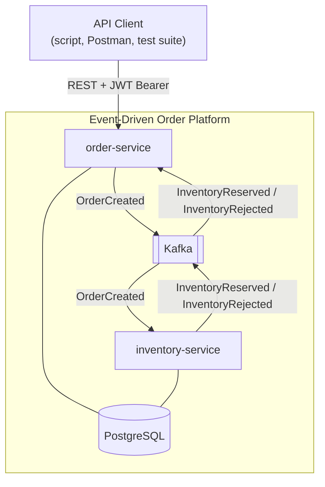

```markdown
- More Information: Implements UC-01 through UC-08 of the SRS. There are no third-party external systems (self-issued authentication, no IdP). Source: SRS 2.1, 2.4.
```

### 3.2 Composition

```markdown
- ID: DV-002
- Title: Container Diagram (C4)
- Viewpoint: Composition
- Representation:
```

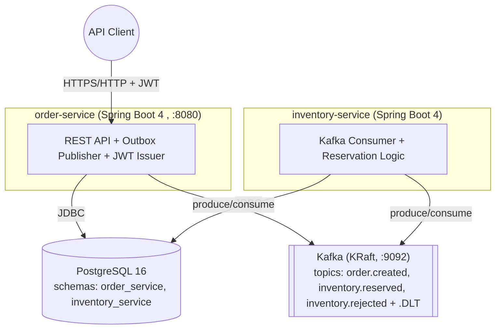

```markdown
- More Information: Each container implements REQ-INST-001 (Docker Compose). Full topology detail in DV-018. Related to ADR-0002 (separate schemas) and ADR-0007 (Kafka KRaft).
```

### 3.3 Logical

```markdown
- ID: DV-003
- Title: Domain Ports — order-service
- Viewpoint: Logical
- Representation:
```

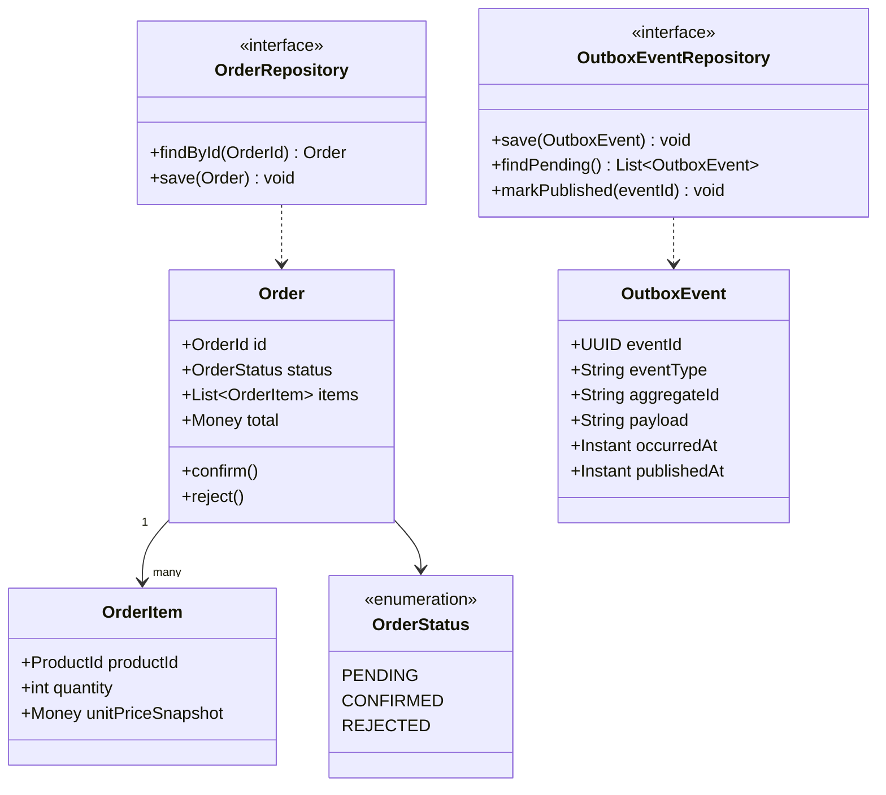

```markdown
- More Information: Implements REQ-FUNC-003/004/005. `OutboxEventRepository` is consumed both by the application service (to persist within the same transaction, ADR-0001) and by the `OutboxPublisherScheduler` adapter (to read pending events). No type in this diagram depends on Kafka or JPA (ADR-0006). Unlike inventory-service (DV-004), the order-service domain does **not** define an `EventPublisher` port: it never publishes directly to Kafka, it only writes to `OutboxEventRepository` — the actual publishing happens entirely in the `OutboxPublisherScheduler` adapter.
```

```markdown
- ID: DV-004
- Title: Domain Ports — inventory-service
- Viewpoint: Logical
- Representation:
```

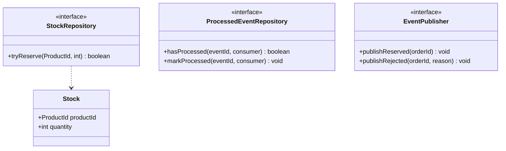

```markdown
- More Information: `tryReserve` encapsulates the atomic conditional UPDATE of ADR-0010 (DV-014). `ProcessedEventRepository` implements the `processed_events` table of REQ-FUNC-016 (DV-013). `EventPublisher` is invoked by `InventoryReservationService` (application layer) after resolving the reservation, and implemented by a `KafkaEventPublisherAdapter` (see DV-005, DV-009, DV-011).
```

### 3.4 Dependency

```markdown
- ID: DV-005
- Title: Allowed Import Directions (Package Dependency Graph)
- Viewpoint: Dependency
- Representation:
```

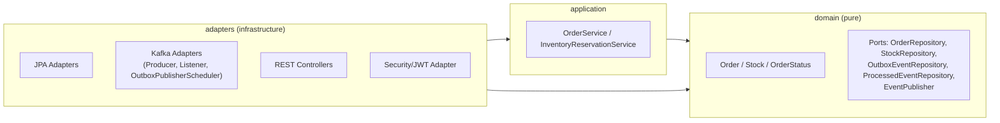

```markdown
- More Information: Implements REQ-MAINT-001 / ADR-0006. Rule verifiable by inspection: no type in the `domain` package imports `org.apache.kafka.*`, `org.springframework.kafka.*`, or JPA annotations (`jakarta.persistence.*`). Arrows only point toward `domain`, never the other way around. The `EventPublisher` port exists only in the inventory-service domain (DV-004); order-service does not need it, since it never publishes directly to Kafka — it only writes to `OutboxEventRepository` (DV-003).
```

### 3.5 Information

```markdown
- ID: DV-006
- Title: Data Model (ERD)
- Viewpoint: Information
- Representation:
```

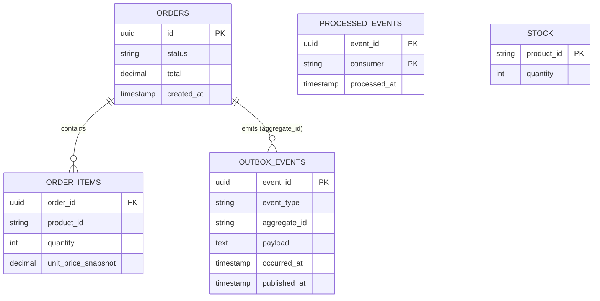

```markdown
- More Information: `ORDERS`, `ORDER_ITEMS`, `OUTBOX_EVENTS`, and one instance of `PROCESSED_EVENTS` (consumer = "order-service") live in the `order_service` schema. `STOCK` and another instance of `PROCESSED_EVENTS` (consumer = "inventory-service") live in the `inventory_service` schema (ADR-0002) — there is no single shared physical table; the pattern is repeated per service. Source: SRS Appendix B, BR-009.
```

### 3.6 Interface

```markdown
- ID: DV-007
- Title: REST API Contract — order-service
- Viewpoint: Interface
- Representation:
```

| Endpoint | Auth | Request | 2xx Response | Errors |
|---|---|---|---|---|
| `POST /auth/token` | No | `{ "clientId": string, "clientSecret": string }` | `200 { "accessToken": string, "tokenType": "Bearer", "expiresIn": 1800 }` | `401` ProblemDetail |
| `POST /api/v1/orders` | Bearer JWT | `{ "items": [{ "productId": string, "quantity": int }] }` | `201 { "orderId": uuid, "status": "PENDING" }` | `400` ProblemDetail + `errors[]`, `401` |
| `GET /api/v1/orders/{id}` | Bearer JWT | — | `200 { "orderId": uuid, "status": string, "items": [...], "total": decimal }` | `404`, `401` |

```markdown
- More Information: Implements REQ-FUNC-001/002/005/006/007/008/009. RFC 7807 error format per SRS 3.1.3. Auth per ADR-0005.
```

```markdown
- ID: DV-008
- Title: Kafka Event Contracts
- Viewpoint: Interface
- Representation:
```

**Topic `order.created`** (key = `aggregateId`, ADR-0003)
```json
{
  "eventId": "uuid",
  "eventType": "OrderCreated",
  "occurredAt": "2026-09-10T12:00:00Z",
  "aggregateId": "orderId-uuid",
  "payload": {
    "orderId": "uuid",
    "items": [ { "productId": "string", "quantity": 0 } ]
  }
}
```

**Topic `inventory.reserved`** (key = `aggregateId`)
```json
{
  "eventId": "uuid",
  "eventType": "InventoryReserved",
  "occurredAt": "2026-09-10T12:00:05Z",
  "aggregateId": "orderId-uuid",
  "payload": { "orderId": "uuid" }
}
```

**Topic `inventory.rejected`** (key = `aggregateId`)
```json
{
  "eventId": "uuid",
  "eventType": "InventoryRejected",
  "occurredAt": "2026-09-10T12:00:05Z",
  "aggregateId": "orderId-uuid",
  "payload": { "orderId": "uuid", "reason": "INSUFFICIENT_STOCK" }
}
```

Dead Letter Topics: `order.created.DLT`, `inventory.reserved.DLT`, `inventory.rejected.DLT` (ADR-0004).

```markdown
- More Information: Implements REQ-MAINT-002. Common envelope per SRS 3.1.3. No Schema Registry (Out-of-Scope) — any payload change must be kept backward-compatible manually.
```

### 3.7 Interaction

```markdown
- ID: DV-009
- Title: Happy Path — Order Creation to Confirmation
- Viewpoint: Interaction
- Representation:
```

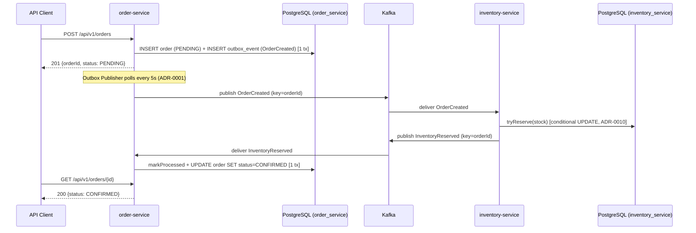

```markdown
- More Information: Implements UC-01, UC-02, UC-04, UC-05. References ADR-0001, ADR-0003, ADR-0010.
```

```markdown
- ID: DV-010
- Title: Failure Path — Kafka Unavailable at Publish Time
- Viewpoint: Interaction
- Representation:
```

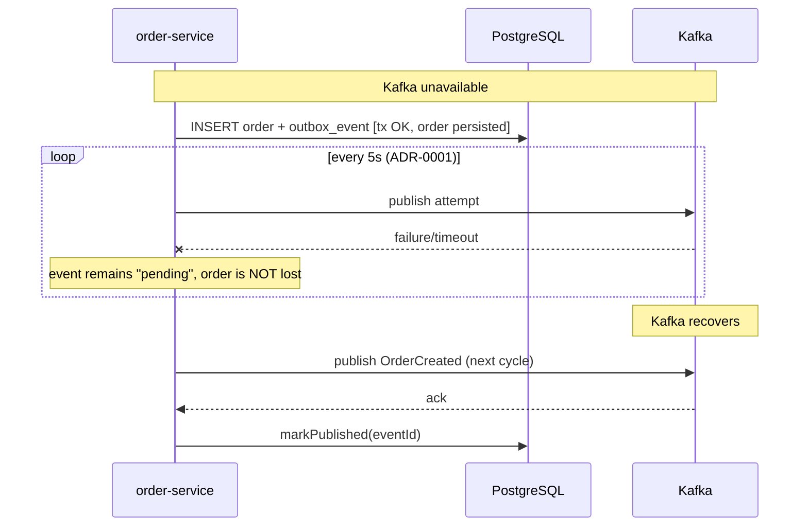

```markdown
- More Information: Implements REQ-FUNC-011. Verifies the SRS NFR Reliability.
```

```markdown
- ID: DV-011
- Title: Failure Path — Duplicate Event Delivery (Idempotency)
- Viewpoint: Interaction
- Representation:
```

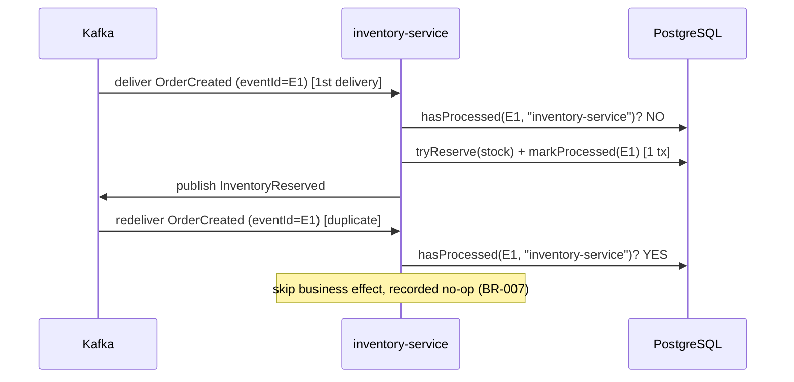

```markdown
- More Information: Implements REQ-FUNC-016, UC-07. Algorithmic detail in DV-013.
```

```markdown
- ID: DV-012
- Title: Failure Path — Consumer Retry Exhaustion to DLT
- Viewpoint: Interaction
- Representation:
```

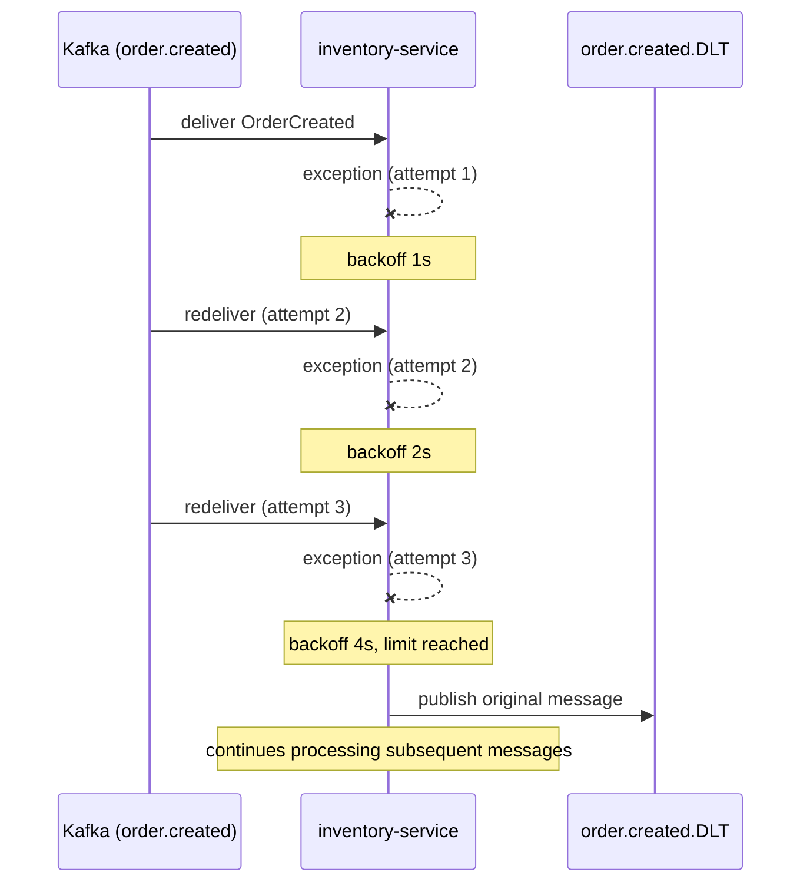

```markdown
- More Information: Implements REQ-REL-001. References ADR-0004.
```

### 3.8 Algorithm

```markdown
- ID: DV-013
- Title: Idempotent Event Processing Algorithm
- Viewpoint: Algorithm
- Representation:
```

```text
function handle(event):
    if processedEventRepository.hasProcessed(event.eventId, CONSUMER_NAME):
        log.info("duplicate event skipped", event.eventId)
        return                              # no-op, BR-007

    applyBusinessEffect(event)              # e.g., tryReserve or state transition
    processedEventRepository.markProcessed(event.eventId, CONSUMER_NAME)
    # both steps in the SAME local consumer transaction
```

```markdown
- More Information: Implements REQ-FUNC-016, BR-006/BR-007. The transactional coupling between `applyBusinessEffect` and `markProcessed` is critical: if they ran in separate transactions, a failure between them could leave the effect applied but unmarked (incorrect future reprocessing) or marked but not applied (lost effect).
```

```markdown
- ID: DV-014
- Title: Atomic Stock Reservation Algorithm
- Viewpoint: Algorithm
- Representation:
```

```text
function tryReserve(productId, quantity):
    rowsAffected = execute(
        "UPDATE stock SET quantity = quantity - :qty
         WHERE product_id = :id AND quantity >= :qty",
        qty=quantity, id=productId
    )
    return rowsAffected == 1        # true = reserved, false = insufficient stock

function reserveForOrder(order):
    for item in order.items:
        if not tryReserve(item.productId, item.quantity):
            rollbackTransaction()
            return REJECTED         # atomic rejection of the whole order, no partial reservations
    return RESERVED
```

```markdown
- More Information: Implements REQ-FUNC-012/013, ADR-0010. Atomicity is guaranteed by PostgreSQL in a single statement, with no explicit application-level locks.
```

### 3.9 State Dynamics

```markdown
- ID: DV-015
- Title: Order State Machine
- Viewpoint: State Dynamics
- Representation:
```

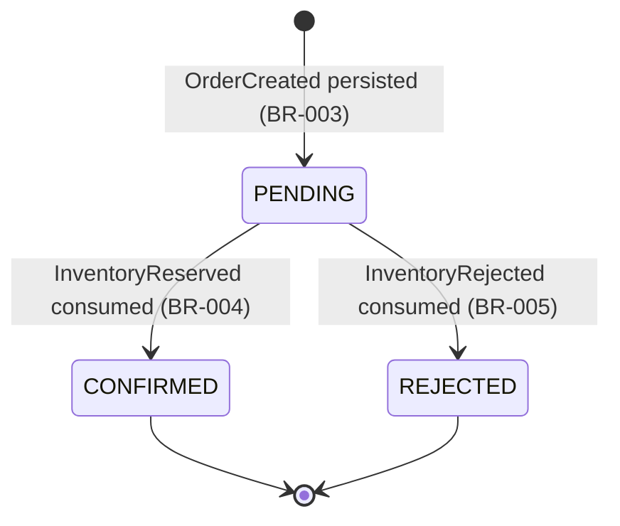

```markdown
- More Information: BR-011 allows the order to remain temporarily in PENDING while the corresponding event has not yet been consumed (eventual consistency, SRS NFR Consistency).
```

### 3.10 Concurrency

```markdown
- ID: DV-016
- Title: Outbox Publisher Singleton & Stock Update Race Avoidance
- Viewpoint: Concurrency
- Representation: Narrative description (no additional diagram; complements DV-009/DV-014)
```

order-service runs as a single instance (an assumption of ADR-0001): the Outbox Publisher's `@Scheduled` task never runs concurrently with itself, so `SELECT ... FOR UPDATE SKIP LOCKED` is not required in this version. inventory-service, on the other hand, may receive concurrent messages from different partitions; correctness under concurrent `OrderCreated` events for the same `productId` does not depend on an application-level lock, but on the fact that the conditional `UPDATE` of DV-014 is atomic at the PostgreSQL engine level — two concurrent transactions on the same row are serialized automatically by the engine. Additionally, the `DefaultErrorHandler` (ADR-0004) blocks the advancement of a partition during the backoff window of a failed message, guaranteeing that there are never two processing attempts of the same message running in parallel.

```markdown
- More Information: References ADR-0001, ADR-0004, ADR-0010.
```

### 3.11 Patterns

```markdown
- ID: DV-017
- Title: Applied Architectural & Design Patterns
- Viewpoint: Patterns
- Representation:
```

| Pattern | Where it is applied | Decision |
|---|---|---|
| Transactional Outbox | order-service (order + event persistence) | ADR-0001 |
| Idempotent Consumer | order-service and inventory-service (`processed_events`) | REQ-FUNC-016, DV-013 |
| Ports & Adapters (Lightweight Hexagonal) | Both services | ADR-0006 |
| Dead Letter Channel | Kafka consumers of both services | ADR-0004 |
| Conditional atomic update (concurrency without explicit locks) | inventory-service | ADR-0010 |

```markdown
- More Information: These patterns are the project's central engineering evidence (Master Context, Goals and Key Engineering Evidence).
```

### 3.12 Deployment

```markdown
- ID: DV-018
- Title: Docker Compose Deployment Topology
- Viewpoint: Deployment
- Representation:
```

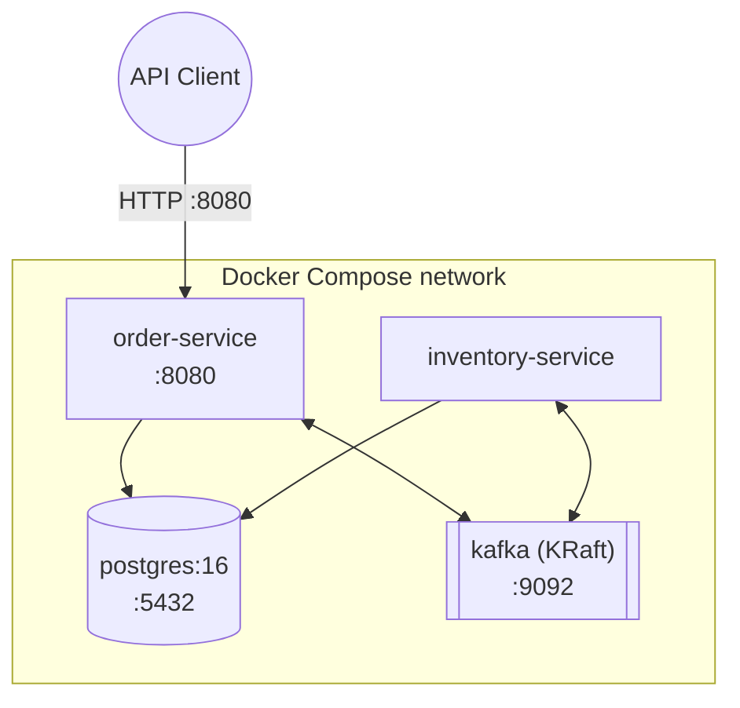

```markdown
- More Information: KRaft mode, no Zookeeper container (ADR-0007). Environment variables externalized per REQ-INST-001 — see Appendix A. A single `docker-compose up` leaves everything operational (REQ-INST-001).
```

## 4. Decisions

The following 10 decisions were detailed and accepted in `MADR.md`. This section summarizes each one; **the normative source is `MADR.md`**, and its full content is not duplicated here.

```markdown
- ID: SDD-DEC-001
- Title: Outbox publishing strategy
- Context: Kafka does not participate in order-service's PostgreSQL transaction (no 2PC); pending events must be published reliably.
- Options: Embedded Polling Publisher / Separate relay service / CDC (Debezium)
- Outcome: Embedded Polling Publisher — see ADR-0001 in MADR.md
- More Information: MADR.md → ADR-0001
```

```markdown
- ID: SDD-DEC-002
- Title: Data ownership in a shared PostgreSQL instance
- Context: Single mandatory instance, with schema separation per domain.
- Options: Schema-level isolation / Shared schema / Separate instances
- Outcome: Schema-level isolation with a dedicated DB role — see ADR-0002 in MADR.md
- More Information: MADR.md → ADR-0002
```

```markdown
- ID: SDD-DEC-003
- Title: Kafka event key/partition strategy
- Context: Preserve per-aggregate ordering in the event of a future increase in partitions.
- Options: Key=aggregateId / No key / Key=eventType
- Outcome: Key=aggregateId — see ADR-0003 in MADR.md
- More Information: MADR.md → ADR-0003
```

```markdown
- ID: SDD-DEC-004
- Title: Consumer retry and Dead Letter Topic strategy
- Context: REQ-REL-001 requires 3 retries with 1s/2s/4s backoff and then a DLT.
- Options: DefaultErrorHandler+DLT recoverer / Manual retry / @RetryableTopic
- Outcome: DefaultErrorHandler + DeadLetterPublishingRecoverer — see ADR-0004 in MADR.md
- More Information: MADR.md → ADR-0004
```

```markdown
- ID: SDD-DEC-005
- Title: JWT authentication and client credentials strategy
- Context: Self-issued JWT, no external IdP, no user management.
- Options: Spring Security Resource Server / Custom filter / Spring Authorization Server
- Outcome: Spring Security Resource Server with a local JWT decoder — see ADR-0005 in MADR.md
- More Information: MADR.md → ADR-0005
```

```markdown
- ID: SDD-DEC-006
- Title: Domain/infrastructure separation (layering)
- Context: REQ-MAINT-001 requires a domain with no dependency on Kafka.
- Options: Lightweight Hexagonal / Simple layers / Full Clean Architecture
- Outcome: Lightweight Hexagonal (Ports & Adapters) — see ADR-0006 in MADR.md
- More Information: MADR.md → ADR-0006
```

```markdown
- ID: SDD-DEC-007
- Title: Kafka deployment mode
- Context: REQ-INST-001 requires single-command startup with minimal complexity.
- Options: KRaft / Classic Kafka+Zookeeper
- Outcome: KRaft (no Zookeeper) — see ADR-0007 in MADR.md
- More Information: MADR.md → ADR-0007
```

```markdown
- ID: SDD-DEC-008
- Title: Structured logging and correlation strategy
- Context: REQ-OBS-001 requires orderId/eventId in all relevant logs.
- Options: MDC + JSON logging / Manual plain text / External observability stack
- Outcome: MDC + JSON logging (Logback encoder) — see ADR-0008 in MADR.md
- More Information: MADR.md → ADR-0008
```

```markdown
- ID: SDD-DEC-009
- Title: DB schema versioning and data seeding
- Context: Full reproducibility required by REQ-INST-001, including seeded client credentials.
- Options: Flyway / Liquibase / ddl-auto + CommandLineRunner
- Outcome: Flyway with a seed migration — see ADR-0009 in MADR.md
- More Information: MADR.md → ADR-0009
```

```markdown
- ID: SDD-DEC-010
- Title: Stock concurrency control in inventory-service
- Context: Avoid overselling under concurrent orders for the same product.
- Options: Atomic conditional UPDATE / Optimistic locking / Pessimistic locking
- Outcome: Atomic conditional UPDATE — see ADR-0010 in MADR.md
- More Information: MADR.md → ADR-0010
```

## 5. Security

### Architectural Security Decisions

- **Zero Clock Skew Tolerance:** JWT validation is configured with zero seconds of clock skew tolerance. Since the token is self-issued and validated within the same internal infrastructure, there is no network delay or external clock synchronization drift to account for, making any tolerance window an unnecessary risk.
- **Dummy Hash Calculation:** To prevent client enumeration via timing attacks, the authentication process executes a dummy hash computation when an unknown client or user is queried. This ensures that the response times for both valid and invalid clients remain indistinguishable.
- **Deny-by-Default Policy:** The resource server enforces a strict deny-by-default access control policy (`anyRequest().authenticated()`). Only a single public endpoint (the token issuance point) is explicitly whitelisted, safely minimizing the exposed attack surface.

## 6. Appendixes

### Appendix A — Environment Variables Reference

| Variable | Service(s) | Description |
|---|---|---|
| `DB_URL` | order-service, inventory-service | JDBC URL to the shared PostgreSQL instance |
| `DB_SCHEMA` | order-service, inventory-service | Own schema (`order_service` / `inventory_service`, ADR-0002) |
| `DB_USER` / `DB_PASSWORD` | order-service, inventory-service | Credentials of the DB role scoped to its schema |
| `KAFKA_BOOTSTRAP_SERVERS` | order-service, inventory-service | Kafka broker address |
| `JWT_SIGNING_SECRET` | order-service | HS256 secret (REQ-SEC-001, ADR-0005) |
| `OUTBOX_POLLING_INTERVAL_MS` | order-service | Outbox Publisher interval, default 5000 (REQ-FUNC-010) |
| `SEED_CLIENT_ID` / `SEED_CLIENT_SECRET` | order-service | Client credentials seeded via Flyway migration (ADR-0009) |

All externalized via Docker Compose environment variables, none hardcoded in the repository (REQ-SEC-001, REQ-INST-001).

### Appendix B — Traceability Matrix (SRS → Design View → ADR)

| SRS Requirement | Design View(s) | ADR(s) |
|---|---|---|
| REQ-FUNC-001 / 002 | DV-007 | — |
| REQ-FUNC-003 / 004 / 005 | DV-003, DV-006, DV-009 | ADR-0001, ADR-0002 |
| REQ-FUNC-006 | DV-007 | — |
| REQ-FUNC-007 / 008 / 009 | DV-007 | ADR-0005 |
| REQ-FUNC-010 / 011 | DV-001, DV-002, DV-009, DV-010, DV-016 | ADR-0001 |
| REQ-FUNC-012 / 013 | DV-004, DV-006, DV-014 | ADR-0010 |
| REQ-FUNC-014 / 015 | DV-009, DV-015 | — |
| REQ-FUNC-016 | DV-004, DV-011, DV-013 | ADR-0002 |
| REQ-PERF-001 | N/A — implementation benchmark, no dedicated design view | — |
| REQ-SEC-001 / 002 | DV-007, Appendix A | ADR-0005 |
| REQ-REL-001 | DV-012 | ADR-0004 |
| REQ-OBS-001 | DV-009 to DV-012 (cross-cutting) | ADR-0008 |
| REQ-COMP-001 | — (outside design scope, see SRS 3.4) | — |
| REQ-INST-001 | DV-018, Appendix A | ADR-0007, ADR-0009 |
| REQ-BUILD-001 | — (outside design scope, see SRS 3.5.2) | — |
| REQ-MAINT-001 | DV-005 | ADR-0006 |
| REQ-MAINT-002 | DV-008 | — |
| REQ-PORT-001 | DV-018 | ADR-0007 |
| REQ-COST-001 | DV-002, DV-018 (cross-cutting) | ADR-0001, ADR-0007 |
| REQ-CM-001 | — (outside design scope, see SRS 3.5.10) | — |
